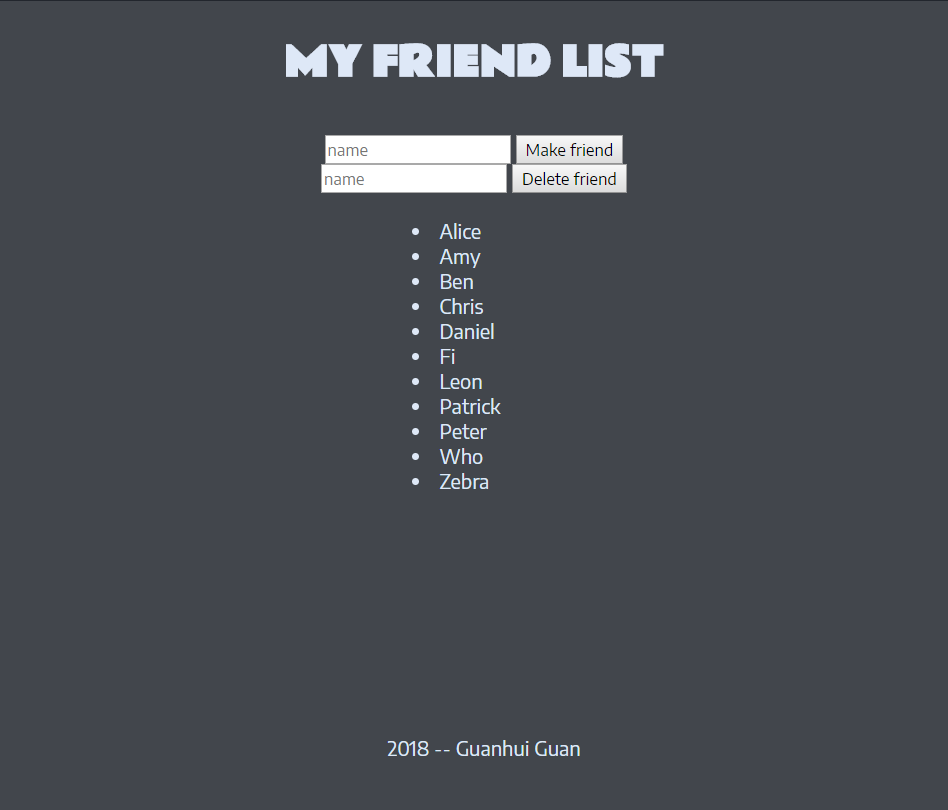

# Web_FriendList
<h2> Test app </h2>

 Requirement: Node Js, MongoDB, Git 

 Operations: View friends list and add friends 

  
 How to: 

  <ol>
    <li> Start MongoDB(boot mongod.exe and mongo.exe)</li>
    <li> Use git to run $ node app.js</li>
    <li> Open a browser and go to http://localhost3000 or http://localhost3000/friends</li>
  </ol>

